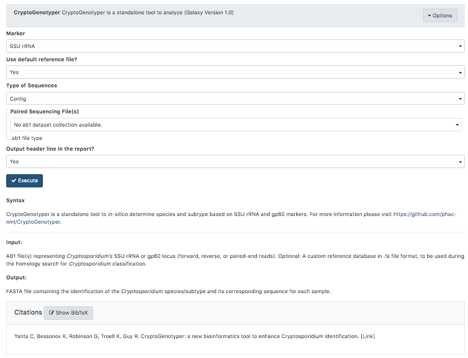

# CryptoGenotyper
This code allows running `CryptoGenotyper` ([https://github.com/phac-nml/CryptoGenotyper](https://github.com/phac-nml/CryptoGenotyper)) on Galaxy Project server with a convenient interface. 

This wrapper provides access to complete functionality of the command line tool allowing incorporation into any workflows.

